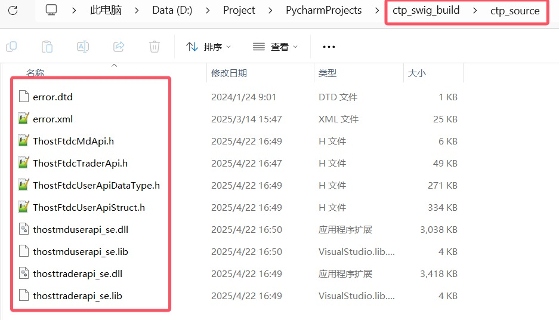
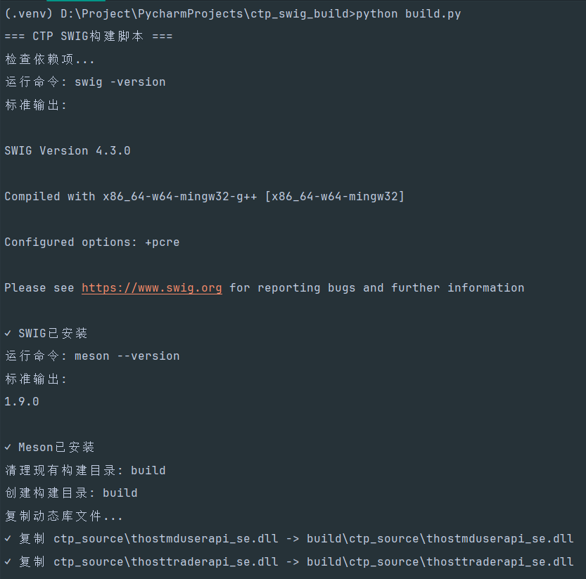
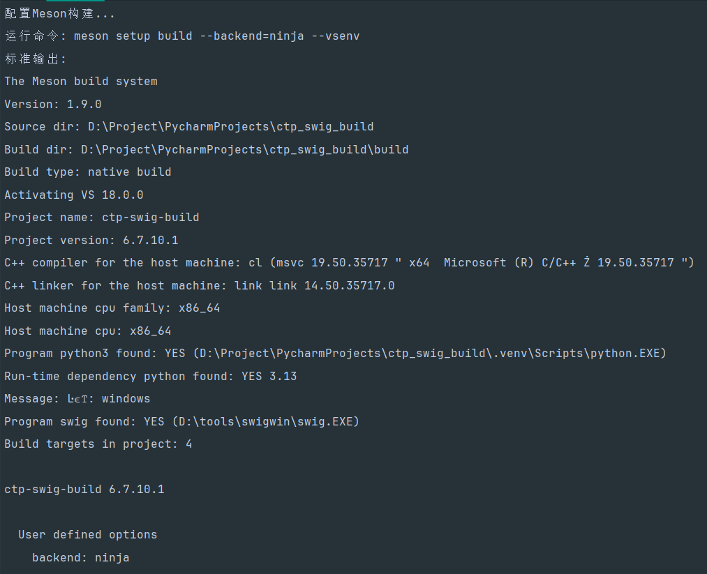
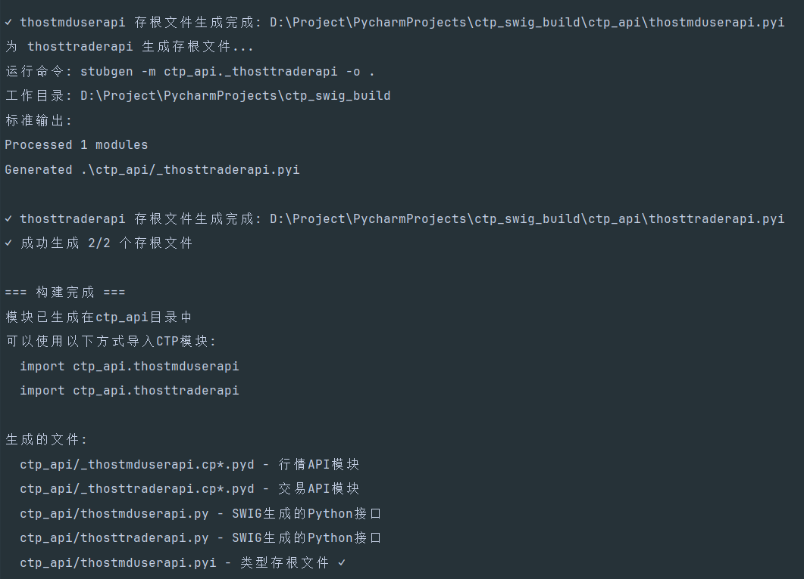

<h1 align="center">ctp_swig_build</h1>

<p align="center">
✨ Enables one-click automatic compilation of CTP C++ interfaces into Python interfaces ✨
</p>


<p align="center">
  English |
  <a href="README_CN.md">简体中文</a>
</p>
**A brief introduction to this project:** This project enables one-click automatic compilation of CTP C++ interfaces into Python interfaces.

Click here to directly experience the compiled Python API file (CTP v6.7.10):

- [Github Releases](https://github.com/Lumosylva/ctp_swig_build/releases)
- [GitCode Releases](https://gitcode.com/Lumosylva/ctp_swig_build/releases/CTP_v6.7.10)

**Tips:** If you are interested in using the Pybind11 compilation method, please refer to another project: https://github.com/Homalos/ctp

A comparison of the Swig and Pybind11 compilation methods is provided at the end of this document. The well-known domestic quantitative open-source framework vn.py uses the Pybind11 compilation method at its core.

Technology Stack: Python + Swig + MSVC + meson-python + mypy

Environment:

Windows: Visual Studio 2022 (select C++ development during installation, mainly providing MSVC + Ninja support)

Linux: GCC (Note: This project has not been tested in a Linux environment, and successful compilation cannot be guaranteed)

## 1. Introduction

Currently, the API version provided by the CTP interface in the previous issue is a C++ version. This article mainly introduces how to use the Swig tool on a Windows 64-bit platform to convert the CTP C++ interface into a Python-callable interface.

## 2. Preparation

- **Download the Official CTP API**

Download the CTP API compressed package from the [SimNow](https://www.simnow.com.cn/static/apiDownload.action) PC tab. Note that this website may be inaccessible outside of trading hours; it is accessible on trading days. This example uses `v6.7.10` **the production version with transparent monitoring** (you can use your desired version; the steps are the same).


The unzipped 64-bit API file package looks like this:


- Download this project

  Use `git clone` or `Download ZIP` (on gitcode, click **Download ZIP**) to download this project to your local machine. Then, copy all the downloaded API files (10 files in total) and replace the existing files in the project's **ctp_source** folder, as shown in the image:



After copying, the project structure will look like this:


- **Installing Swig**

The Swig version used in this article is **swigwin-4.3.0**, which can be downloaded here: [Click here to download](https://zenlayer.dl.sourceforge.net/project/swig/swigwin/swigwin-4.3.0/swigwin-4.3.0.zip?viasf=1). More Swig versions can be downloaded here: [Download address](https://sourceforge.net/projects/swig/files/swigwin/).

(If you don't want to install SWIG from a binary file, you can also install it using `uv add swig` or `pip install swig`.)

- **Installing Python**

It is recommended to use `UV` for installation. Instructions for installing and using UV are provided below. Other Python management tools can also be used, but you will need to configure the relevant environment yourself. Note that you must install a 64-bit Python version and configure the environment variables correctly. This article uses version **3.13.6**. If you are using a different version, the following steps are the same.

- **Installing Visual Studio** (Windows environment installation, Linux environment GCC installation)

This mainly uses `MSVC` and `Ninja`. This article uses **Visual Studio 2022**. Note that when installing Visual Studio, you should select **C++** development.

## 3. Installing UV and Python Environment

This project recommends using `UV` to manage Python installations and dependency installations.

1. Installing UV

i. On Windows

**Method 1: Global Installation (Recommended, choose one)**

Run the following command in PowerShell (not cmd):

```bash
powershell -ExecutionPolicy ByPass -c "irm https://astral.sh/uv/install.ps1 | iex"
```

**Method 2: Installing in the Python Environment Separately (Choose one)**

```bash
pip install uv
```

ii. On Linux

```bash
curl -LsSf https://astral.sh/uv/install.sh | sh
```

2. Install Python (Perform this step if you are using Method 1, skip this step if you are using Method 2). You can install the version you need.

```bash
uv python install 3.13
```

3. Install a Python virtual environment in the project root directory (isolated from the globally installed Python environment in the previous step), and install project dependencies to ensure environment consistency. The dependencies installed by `uv sync` are based on the library names defined in the `dependencies` section of the `pyproject.toml` file.

```bash
uv venv --python 3.13 .venv
uv sync
```

## 4. Usage

### Usage:

1. Activate the Python virtual environment:

```bash
.venv\Scripts\activate
```

2. Run the build:

```bash
python build.py
```

3. Test compilation:

The demo file is `ctp_demo.py`; simply run this.

## 5. Execution Result

Running `python build.py`:







After running the compilation script, the Python API compilation artifacts will be generated in the project's **ctp_api** directory.

Running `ctp_demo.py` will display the compilation test results:


## 6. What the Compilation Script Mainly Does:

build.py file:

- Check all necessary dependencies (SWIG, Meson, Ninja)

- Automatically set up and clean the build directory

- Configure Meson build (supports MSVC environment)

- Execute the compilation and installation process, generating .pyd files

- Copy the .pyd files to the ctp folder in the project root directory

- Automatically rename the files, adding an underscore before the filename

- Simultaneously processes related .lib files

- Generates type stub files using mypy's built-in stubgen

Provides various command-line options (configure only, skip stub generation, etc.)

meson.build file:

- Configures the C++17 compilation environment

- Automatically finds the Python interpreter and SWIG tools

- Configures SWIG wrapper code generation for the market data API (thostmduserapi) and trading API (thosttraderapi) respectively

- Sets the correct include directories and library file links

- Automatically installs the generated Python files and DLL files

### Key Features:

- ✅ Supports multithreading (-threads parameter)

- ✅ Automatically handles Chinese encoding conversion

- ✅ Provides IDE support for type stub file generation

- ✅ Supports Windows MSVC compilation environment

- ✅ Automatically copies necessary files

- ✅ No need to open Visual Studio Studio can perform one-click compilation.

This ensures that the Python module generated by SWIG can correctly find and import the underlying C extension module. After the build is complete, you will get a full Python extension module, allowing you to directly use all the functionality of the CTP API in your Python code.

## 7. Project Structure

```reStructuredText
ctp_swig_build/
├── 📁 assets/		# The resource folder contains some images.
├── 📁 build/		# The compilation process folder is not required.
├── 📁 ctp_api/		# The CTP API compilation artifacts folder contains the compiled Python API-related files.
│   ├── 📁 __init__.py
│   ├── 📁 _thostmduserapi.cp313-win_amd64.pyd	# The market data API module is automatically generated by the compilation script.
│   ├── 📁 _thosttraderapi.cp313-win_amd64.pyd	# The trading API module is automatically generated by the compilation script.
│   ├── 📁 thostmduserapi.py		# Python market data interface generated by SWIG
│   ├── 📁 thosttraderapi.py		# Python trading interface generated by SWIG
│   ├── 📁 thostmduserapi.pyi		# stub file
│   ├── 📁 thosttraderapi.pyi		# stub file
│   ├── 📁 thostmduserapi_se.dll	# Market Data Library
│   └── 📁 thosttraderapi_se.dll	# Transaction Dynamics Library
├── 📁 ctp_source/                  # The CTP API source file folder contains the original C++ API-related files.
│   ├── 📁 error.dtd					# Includes all possible error messages
│   ├── 📁 error.xml					# Includes all possible error messages
│   ├── 📁 ThostFtdcMdApi.h				# C++ header file, containing commands related to retrieving market data.
│   ├── 📁 ThostFtdcTraderApi.h			# C++ header files containing transaction-related instructions, such as order placement.
│   ├── 📁 ThostFtdcUserApiDataType.h	# It contains all the data types used.
│   ├── 📁 ThostFtdcUserApiStruct.h		# It includes all the data structures used.
│   ├── 📁 thostmduserapi_se.dll	# Dynamic link library for market data section
│   ├── 📁 thostmduserapi_se.lib	# Static link library for market data section
│   ├── 📁 thosttraderapi_se.dll	# Dynamic link library for the transaction section
│   └── 📁 thosttraderapi_se.lib	# Static link library for the transaction section
├── 📁 build.py                     # Compilation script
├── 📁 ctp_demo.py                  # The test demo can be run to test whether the compilation was successful.
├── 📁 meson.build                  # Meson configuration file (Don't worry about this if you don't understand Meson configuration).
├── 📁 thostmduserapi.i		    	# The interface file is used to tell SWIG which market data classes and methods to create interfaces for.
├── 📁 thosttraderapi.i		    	# The interface file is used to tell SWIG which transaction classes and methods to create interfaces for.
├── 📁 pyproject.toml               # Python project management configuration file, automatically generated by UV, containing project information.
├── 📁 README.md                    # Project Description Document
├── 📁 uv.lock                      # The UV lock file is automatically generated by UV and does not require your attention.
└── 📁 ...                          # Other files
```

## 8. Follow-up Work

**Prompt: import \_\_builtin\_\_ error**

When you open `thostmduserapi.py` or `thosttraderapi.py` When encountering this error, the following error may occur:


Simply change the code to:


Manual Compilation Tutorial:

[CTP Python API Windows Version Wrapped with SWIG (traderapi)](https://blog.csdn.net/mdd2012/article/details/145290497)

[CTP Python API Windows Version Wrapped with SWIG (mduserapi)](https://blog.csdn.net/mdd2012/article/details/145291662)

## 9. More

Detailed Comparison of Pybind11 and SWIG from Multiple Dimensions

|            feature             | Pybind11                                                     | SWIG                                                         |
| :----------------------------: | :----------------------------------------------------------- | :----------------------------------------------------------- |
|   **Philosophy and Design**    | The **header-only** library mimics Boost.Python but is more lightweight and employs modern C++ (11+) metaprogramming techniques. | The **interface compiler** is a standalone program that defines bindings through a separate `.i` interface file. |
| **Usability and coding style** | **Very intuitive.** The binding code is written directly in the C++ source file, using syntax similar to function calls and class definitions, making it feel like part of the language. The syntax is concise and tightly integrated with C++. | **Declarative**. This requires learning a new "interface description language," separate from C++ code, and requires writing a separate .i interface file. |
|       **Learning curve**       | **Low** (if you understand modern C++). Very natural for C++ developers. | **Intermediate to Advanced**. Requires learning SWIG's specific syntax and commands, and is conceptually more independent. |
|     **Compilation speed**      | **Fast.** Because it's a header file library, it's directly included at compile time, and modern compilers optimize it very well. | **Slow**. SWIG first parses the C++ header and interface files, generating a **huge and bloated** C++ source file, and then compiles it. |
|    **Generated code size**     | **Small and efficient.** The generated code is very concise, containing only the parts you actually bind. | **Very large**. The generated wrapper code is extremely large because it attempts to handle all possible edge cases and multi-language support. |
|      **Feature support**       | **Excellent support for modern C++.** Seamlessly supports `std::shared_ptr`, `std::unique_ptr`, `lambda`, `stl` containers, etc. Due to its template-based metaprogramming design, its support for modern C++ features is top-tier. | **Extensive support but may require configuration.** It supports many features, but often requires additional "type mapping" to properly handle complex C++ type to Python type conversions. |
|    **Multilingual support**    | **Python only** (official core). There are experimental forks for other languages in the community, but they are not mainstream. | **Core Advantages**. **Supports a wide range of languages** (Python, Java, C#, Go, Perl, Ruby, Lua, R, PHP, etc.). A single interface can generate multi-language bindings. |
|  **Community and popularity**  | **Extremely high** (in the C++/Python field). It is the **de facto standard** in this field and the first choice for new projects. | **Stable and long-standing.** It boasts a long history and a large existing codebase, making it extremely stable. |
|        **performance**         | The generated binary modules show almost no difference in **invocation performance**. Pybind11 typically compiles faster than SWIG (the total time for SWIG to generate and compile code). | The generated binary modules show almost no difference in **invocation performance**. Modules generated by SWIG, due to their larger code size, typically have longer import times than those generated by Pybind11. |

## 10. Disclaimer

**Note**: Please read the following disclaimer before using this project:

**Last Updated Date**: November 20, 2025

**Effective Date**: Effective immediately upon first release

### Important Note

Before using ctp_swig_build (hereinafter referred to as "this system"), please carefully read and fully understand the following terms. By using this system, you agree to all the contents of this disclaimer.

### Terms and Conditions

#### Article 1 Product Nature

1. This system is a technical software tool and does not constitute any form of investment advice.

2. The developer does not guarantee the completeness, accuracy, or timeliness of this system.

#### Article 2 Risk Warning

1. Actual transaction results are affected by various factors such as market fluctuations, network latency, and policy changes.

2. Users shall bear all consequences of their trading decisions.

#### Article 3 Limitation of Liability

The developer shall not be liable for the following:

- Direct or indirect losses caused by the use of this system

- Interruption or errors of third-party data services

- System unavailability due to force majeure

- Transaction problems caused by user operational errors

#### Article 4 Compliance Requirements

1. Users shall ensure that their use complies with local regulatory requirements.

2. It is prohibited to use this system for illegal arbitrage, market manipulation, or other illegal activities.

#### Article 5 Intellectual Property

This project uses the MIT License.

#### Article 6 Updates to this Statement

1. The developer has the right to update this statement from time to time.

2. Continued use constitutes acceptance of the updated terms.

#### Dispute Resolution

This statement is governed by the laws of the People's Republic of China. Any dispute shall first be settled amicably through negotiation; if negotiation fails, it shall be submitted to an arbitration commission for arbitration.

------

*Please ensure you have fully read and understood the above terms before using this system. If you have any questions, please consult a legal professional.*

## 11. Exchange and Learning

&ensp;[](https://qun.qq.com/universal-share/share?ac=1&authKey=dzGDk%2F%2Bpy%2FwpVyR%2BTrt9%2B5cxLZrEHL793cZlFWvOXuV5I8szMnOU4Wf3ylap7Ph0&busi_data=eyJncm91cENvZGUiOiI0NDYwNDI3NzciLCJ0b2tlbiI6IlFrM0ZhZmRLd0xIaFdsZE9FWjlPcHFwSWxBRFFLY2xZbFhaTUh4K2RldisvcXlBckZ4NVIrQzVTdDNKUFpCNi8iLCJ1aW4iOiI4MjEzMDAwNzkifQ%3D%3D&data=O1Bf7_yhnvrrLsJxc3g5-p-ga6TWx6EExnG0S1kDNJTyK4sV_Nd9m4p-bkG4rhj_5TdtS5lMjVZRBv4amHyvEA&svctype=4&tempid=h5_group_info)

------

*ctp_swig_build* *Last updated: 2025-11-21*