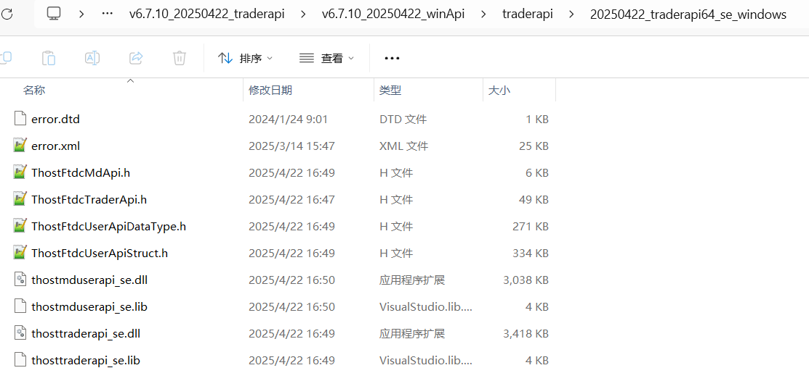
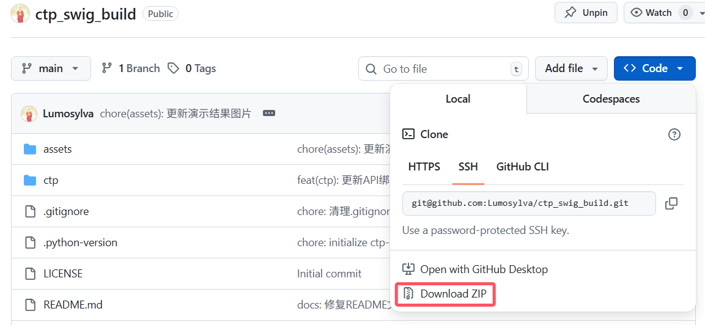
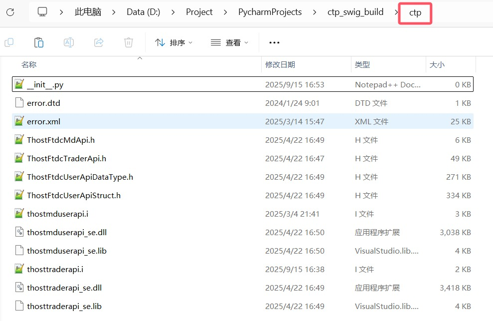
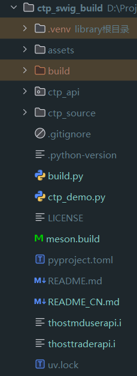
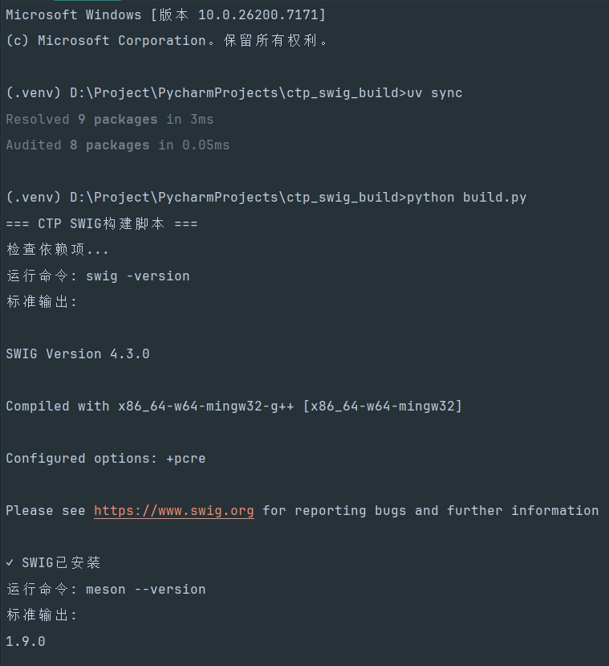
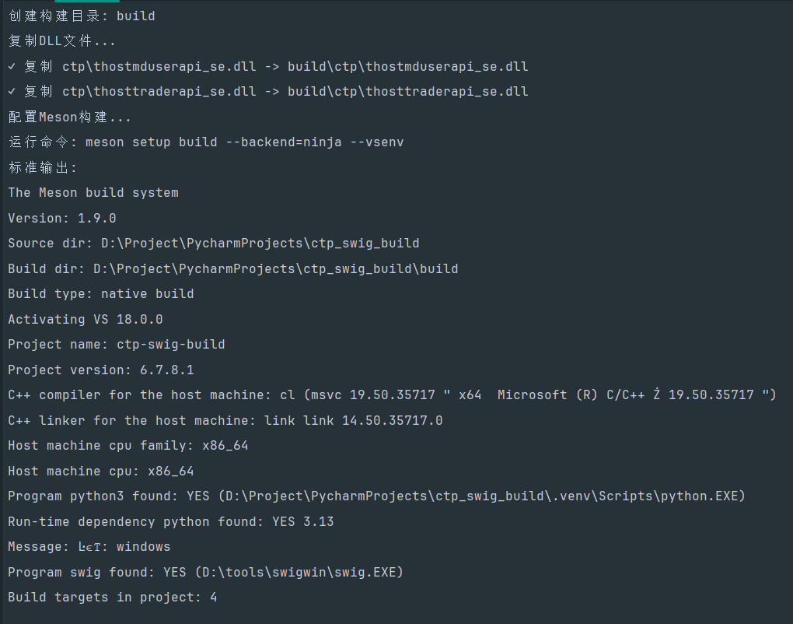
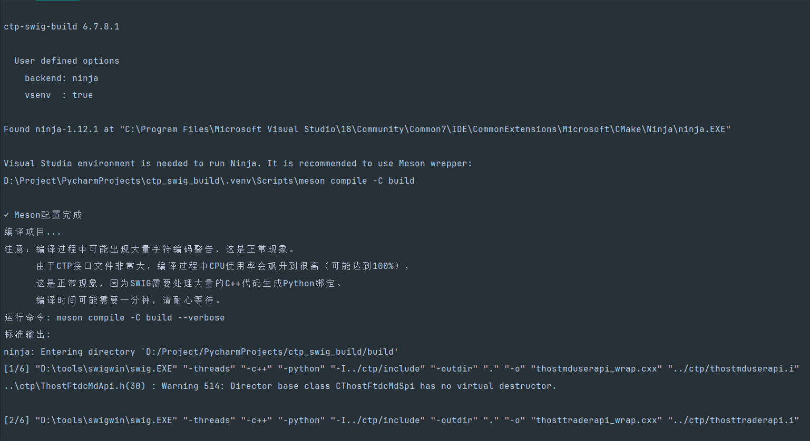
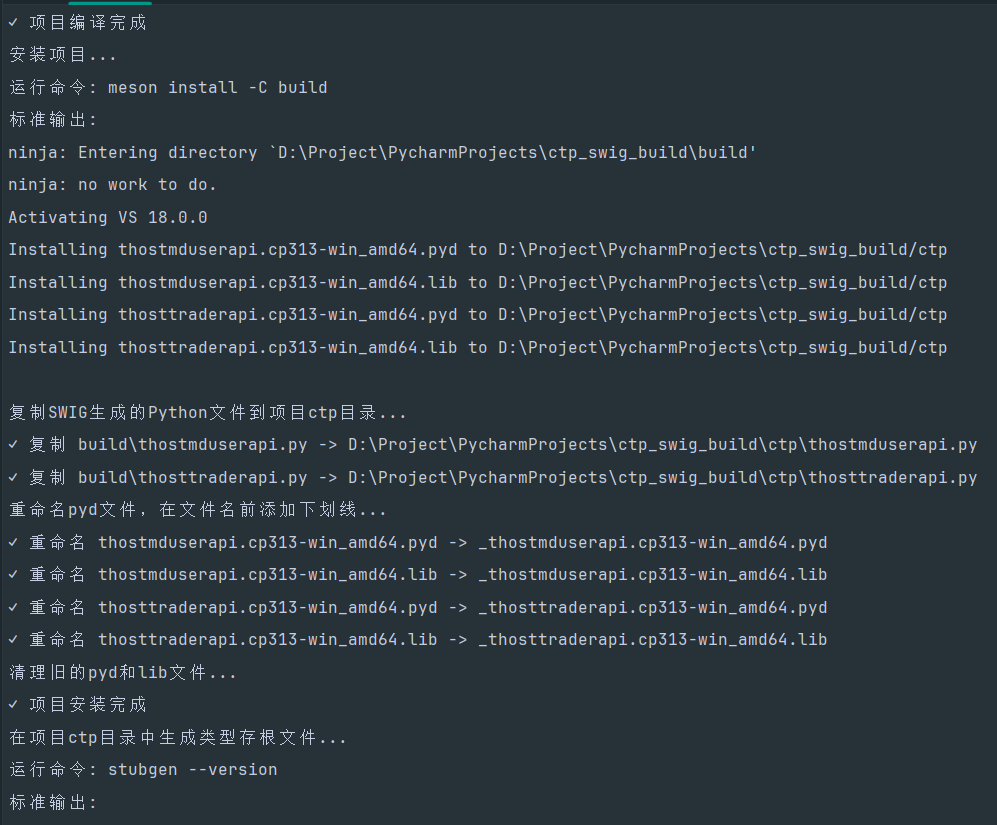
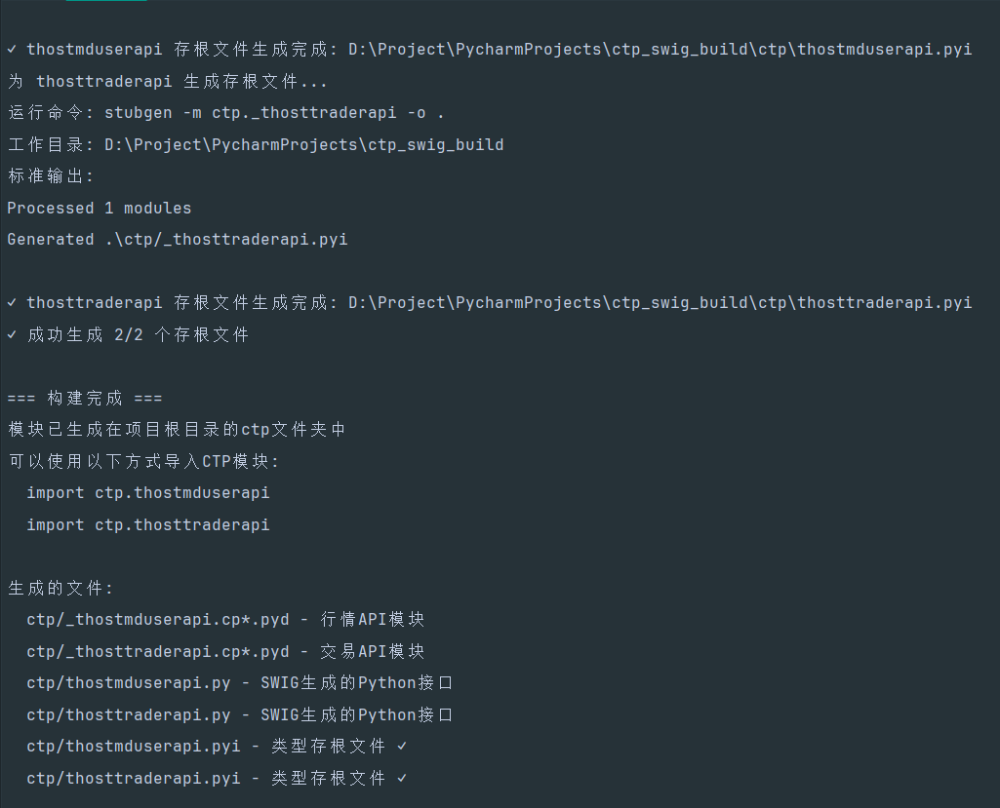
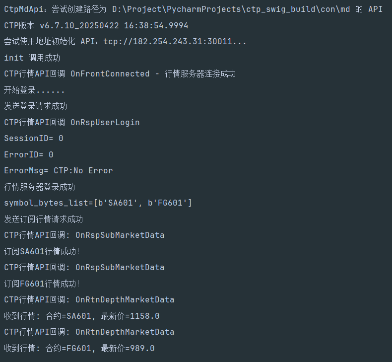

# ctp_swig_build 项目说明
**一句话介绍本项目**：一键实现自动编译 CTP C++ 接口为 Python 接口。

戳这里可以直接体验编译好的 Python API 文件 => ：[Releases](https://github.com/Lumosylva/ctp_swig_build/releases)

**Tips**: 如果你对使用 Pybind11 编译方式感兴趣，可参考另外一个项目：https://github.com/Homalos/ctp

本文档末尾有 Swig 编译方式与 Pybind11 编译方式的对比，国内著名量化开源框架 vn.py 底层就是使用的 Pybind11 编译方式。

## 1. 前言

目前上期技术CTP接口提供的API版本是 C++版本，本文主要介绍在Windows 64位平台下利用 Swig 工具将CTP C++接口转换为Python可调用的接口。

## 2. 准备工作

- **下载官方 CTP API**

  从 SimNow [官网](https://www.simnow.com.cn/static/apiDownload.action)PC标签页下载 CTP API 压缩包，注意非交易时间段此网站可能会出现不能访问，可在交易日访问。这里以 `v6.7.10` **看穿式监管生产版本**为例（你可以自行用需要的版本，步骤一样）


  64位的API文件包解压后清单如下：



- 下载本项目

  

  使用 `git clone` 或者  `Download ZIP` (在gitcode上是点击**下载zip**)将本项目下载到本地，然后将上述所有 API 文件复制并替换掉 **ctp** 内文件。

  

  完成之后项目结构如下：

  

- **安装 Swig**

  本文中所用的Swig是 **`swigwin-4.3.0`** 版本，[点击此处下载](https://zenlayer.dl.sourceforge.net/project/swig/swigwin/swigwin-4.3.0/swigwin-4.3.0.zip?viasf=1)，更多Swig版本 [下载地址](https://sourceforge.net/projects/swig/files/swigwin/)。

- **安装 Python**

  推荐使用 `UV` 来安装，下面有UV的安装使用说明。也可以使用其他 Python 管理工具，但是需自行配置相关环境。注意要安装64位Python版本，将环境变量配置好。本文所用的是 **`3.13.6`** 版本，如果自用到别的版本，下列步骤一致。

- **安装 Visual Studio**

  主要是用到其中的 `MSVC` 和 `Ninja`，本文所用的是 **Visual Studio 2022**，注意安装 Visual Studio 的时候勾选上 **C++** 开发。

## 3. 安装UV和Python环境   

本项目推荐使用 `UV` 来管理 Python 安装和依赖包安装

1. 安装UV

   i. 在Windows系统

   **方式一：全局安装(推荐方式，二选一)**

   在PowerShell中运行下述命令(注意不是cmd)

   ```bash
   powershell -ExecutionPolicy ByPass -c "irm https://astral.sh/uv/install.ps1 | iex"
   ```

   **方式二：单独在 Python 环境中安装(二选一)**

   ```bash
   pip install uv
   ```

   ii. 在Linux系统

   ```bash
   curl -LsSf https://astral.sh/uv/install.sh | sh
   ```

3. 安装 Python(方式一进行这一步，方式二直接跳过)，你可以安装自己需要的版本

   ```bash
   uv python install 3.13
   ```

3. 在项目根目录下安装 Python 虚拟环境(与上一步全局安装的 Python 环境是隔离的)，同时安装项目依赖，以确保环境的一致性。`uv sync` 安装的依赖包依据 **`pyproject.toml`** 文件中 dependencies 中定义的库名来安装。

   ```bash
   uv venv --python 3.13 .venv
   uv sync
   ```


## 4. 使用

项目使用 `SWIG + MSVC + Meson + Stubgen` 的组合来编译CTP C++ API生成Python扩展模块。

### 使用方法：

1. 激活 Python 虚拟环境：

   ```bash
   .venv\Scripts\activate
   ```

2. 运行构建：

   ```bash
   python build.py
   ```

3. 测试接口：

   demo文件为 `ctp_demo.py`，运行这个即可。

## 5. 执行结果展示

运行 `python build.py` 结果











运行 `ctp_demo.py` 结果：



## 6. 编译脚本主要做了什么：

build.py文件：

- 检查所有必要的依赖项（SWIG、Meson、Ninja）
- 自动设置和清理构建目录
- 配置Meson构建（支持MSVC环境）
- 执行编译和安装过程，编译生成pyd文件
- pyd文件复制到项目根目录的ctp文件夹
- 自动重命名，在文件名前添加下划线
- 同时处理相关的.lib文件
- 使用mypy自带的stubgen生成类型存根文件
- 提供了多种命令行选项（仅配置、跳过存根生成等）

meson.build文件：

- 配置了C++17编译环境

- 自动查找Python解释器和SWIG工具

- 为行情API（thostmduserapi）和交易API（thosttraderapi）分别配置SWIG包装代码生成

- 设置了正确的包含目录和库文件链接

- 自动安装生成的Python文件和DLL文件


### 主要特点：

- ✅ 支持多线程（-threads参数）
- ✅ 自动处理中文编码转换
- ✅ 生成类型存根文件提供IDE支持
- ✅ 支持Windows MSVC编译环境
- ✅ 自动复制必要的文件
- ✅ 无需打开Visual Studio即可实现一键编译

这样可以确保SWIG生成的Python模块能够正确找到并导入底层的C扩展模块，构建完成后，将得到完整的Python扩展模块，可以直接在Python代码中使用CTP API的所有功能。

## 7. 项目结构

```reStructuredText
ctp_swig_build/
├── 📁 assets/                      # 资源文件夹，包含一些图片展示
├── 📁 build/					    # 编译过程文件夹，不用关注
├── 📁 ctp/                         # CTP API文件文件夹，存放CTP API相关文件
│   ├── 📁 _thostmduserapi.cp313-win_amd64.pyd		# 重命名后的行情API模块，由编译脚本自动生成
│   ├── 📁 _thostmduserapi.cp313-win_amd64.lib		# 重命名后的库文件，由编译脚本自动生成
│   ├── 📁 _thosttraderapi.cp313-win_amd64.pyd		# 重命名后的交易API模块，由编译脚本自动生成
│   ├── 📁 _thosttraderapi.cp313-win_amd64.lib		# 重命名后的库文件，由编译脚本自动生成
│   ├── 📁 thostmduserapi.i		    # 接口文件，用于告诉swig为哪些行情类和方法创建接口。
│   ├── 📁 thosttraderapi.i		    # 接口文件，用于告诉swig为哪些交易类和方法创建接口。
│   ├── 📁 thostmduserapi.py		# SWIG生成的Python 行情接口
│   ├── 📁 thosttraderapi.py		# SWIG生成的Python 交易接口
│   ├── 📁 thostmduserapi.pyi		# 利用mypy自带的stubgen生成行情存根文件，作用是在IDE中使用时提供代码提示
│   ├── 📁 thosttraderapi.pyi		# 利用mypy自带的stubgen生成交易存根文件，作用是在IDE中使用时提供代码提示
│   ├── 📁 __init__.py				# Python包初始化文件
│   ├── 📁 thostmduserapi_se.dll	# 行情API动态库
│   ├── 📁 thosttraderapi_se.dll	# 交易API动态库
│   └── 📁 ...                      # 其他文件
├── 📁 build.py                     # 编译脚本
├── 📁 ctp_demo.py                  # 测试demo
├── 📁 meson.build                  # meson配置文件(不懂meson配置不用关注)
├── 📁 pyproject.toml               # Python项目管理配置文件，由UV自动生成，包含项目信息
├── 📁 README.md                    # 项目说明文档
├── 📁 uv.lock                      # UV锁定文件，由UV自动生成，不用关注
└── 📁 ...                          # 其他文件
```

## 8. 后续工作

**提示 import \_\_builtin\_\_ 错误**

当你打开 `thostmduserapi.py` 或 `thosttraderapi.py` 时，可能会出现以下错误


只需改为以下代码即可解决：


手动编译教程：

[CTP Python API 利用Swig 封装Windows版（traderapi）](https://blog.csdn.net/mdd2012/article/details/145290497)

[CTP Python API 利用Swig 封装Windows版（mduserapi）](https://blog.csdn.net/mdd2012/article/details/145291662)

## 9. 更多

Pybind11 和 SWIG 多个维度详细的比较

|         特性         | Pybind11                                                     | SWIG                                                         |
| :------------------: | :----------------------------------------------------------- | :----------------------------------------------------------- |
|    **哲学与设计**    | **头文件库（Header-only）**，模仿 Boost.Python 但更轻量，采用现代 C++（11+）元编程技术。 | **接口编译器**，是一个独立的程序，通过一个独立的 `.i` 接口文件来定义绑定。 |
| **易用性与代码风格** | **非常直观**。绑定代码直接写在 C++ 源文件中，使用类似于函数调用和类定义的语法，感觉像是语言的一部分。语法简洁，与C++紧密集成。 | **声明式**。需要学习一门新的“接口描述语言”，与C++代码分离，需要编写一个独立的 .i 接口文件。 |
|     **学习曲线**     | **低**（如果你懂现代C++）。对于C++开发者来说非常自然。       | **中到高**。需要学习SWIG的特定语法和指令，概念上更独立。     |
|     **编译速度**     | **快**。因为是头文件库，编译时直接包含，现代编译器优化得很好。 | **慢**。SWIG会先解析C++头文件和接口文件，生成一个**巨大且臃肿**的C++源文件，然后再编译它。 |
|   **生成代码大小**   | **小且高效**。生成的代码非常精简，只包含你实际绑定的部分。   | **大**。生成的包装代码非常庞大，因为它试图处理所有可能的边界情况和多语言支持。 |
|     **特性支持**     | **对现代C++支持极好**。无缝支持 `std::shared_ptr`, `std::unique_ptr`, `lambda`, `stl`容器等。由于其基于模板元编程的设计，它对现代 C++ 特性的支持是第一梯队的。 | **支持广泛但可能需要配置**。支持很多特性，但通常需要额外的“类型映射”来正确处理复杂的C++类型到Python类型的转换。 |
|    **多语言支持**    | **仅限 Python** (官方核心)。社区有实验性的其他语言分支，但非主流。 | **核心优势**。**支持大量语言**（Python, Java, C#, Go, Perl, Ruby, Lua, R, PHP等）。一套接口可生成多语言绑定。 |
|   **社区与流行度**   | **极高**（在C++/Python领域）。是当前该领域的**事实标准**，新项目首选。 | **稳定且悠久**。拥有悠久的历史和庞大的现有代码库，非常稳定。 |
|       **性能**       | 生成的二进制模块在**调用性能**上几乎没有差异。Pybind11 的编译速度通常快于 SWIG（SWIG 生成代码 + 编译代码的总时间）。 | 生成的二进制模块在**调用性能**上几乎没有差异。SWIG 生成的模块因为代码庞大，其导入时间（import time）通常比 Pybind11 生成的模块要长。 |

## 10. 免责声明

**注意**：使用本项目前请阅读以下声明内容：

**最后更新日期**：2025年11月20日

**生效日期**：首次发布即生效

### 重要提示

在使用 ctp_swig_build（以下简称"本系统"）前，请仔细阅读并充分理解以下条款。通过使用本系统，即视为您已接受本免责声明的全部内容。

### 声明条款

#### 第一条 产品性质

1. 本系统为技术工具软件，不构成任何形式的投资建议
2. 开发者不承诺本系统的完整性、准确性和时效性

#### 第二条 风险提示

1. 实际交易结果受市场波动、网络延迟、政策变化等多种因素影响
2. 使用者应自行承担交易决策的全部后果

#### 第三条 责任限制

开发者不对以下情况承担责任：

- 因使用本系统导致的直接或间接损失
- 第三方数据服务的中断或错误
- 不可抗力导致的系统不可用
- 用户操作失误引发的交易问题

#### 第四条 合规要求

1. 用户应确保使用行为符合所在地监管规定
2. 禁止将本系统用于非法套利、市场操纵等违法行为

#### 第五条 知识产权

本项目使用 MIT License

#### 第六条 声明更新

1. 开发者有权不定期更新本声明
2. 继续使用视为接受更新后的条款

#### 争议解决

本声明适用中华人民共和国法律。任何争议应首先通过友好协商解决，协商不成则提交仲裁委员会仲裁。

------

*请在使用本系统前确保已完整阅读并理解上述条款。如有疑问，请咨询专业法律人士。*

*ctp_swig_build* *最后更新日期: 2025-11-20*